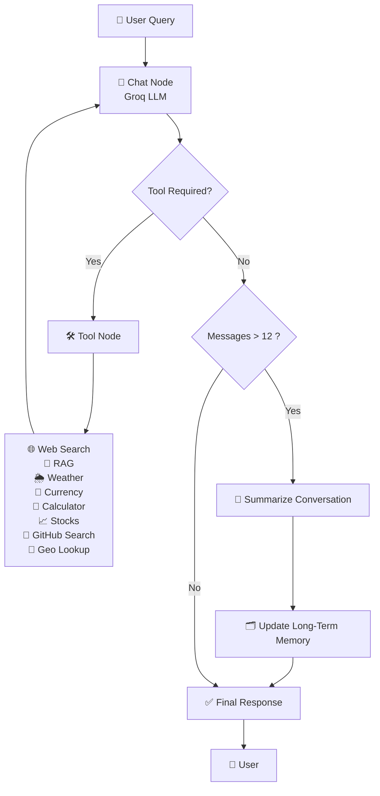
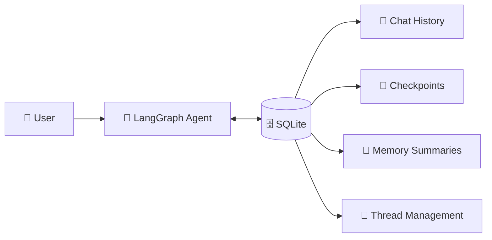

## 🏗️ System Architecture

Synapse AI is built using a LangGraph-based agent architecture with persistent memory, intelligent tool-calling, and automatic conversation summarization.

### High-Level Architecture


```mermaid
flowchart TD

    A[👤 User Query] --> B[🧠 Chat Node<br/>Groq LLM]

    B --> C{Tool Required?}

    C -->|Yes| D[🛠️ Tool Node]

    D --> E[
    🌐 Web Search
    📄 RAG
    🌦️ Weather
    💱 Currency
    🧮 Calculator
    📈 Stocks
    🐙 GitHub Search
    📍 Geo Lookup
    ]

    E --> B

    C -->|No| F{Messages > 12 ?}

    F -->|Yes| G[📝 Summarize Conversation]

    G --> H[🗂️ Update Long-Term Memory]

    H --> I[✅ Final Response]

    F -->|No| I

    I --> J[👤 User]
```

---

### LangGraph Workflow

```mermaid
flowchart TD

    START([START])

    START --> CHAT[🧠 chat_node]

    CHAT --> DECISION{should_summarize()}

    DECISION -->|Tool Calls Present| TOOLS[🛠️ ToolNode]

    TOOLS --> CHAT

    DECISION -->|Messages > 12| SUMMARY[📝 summarize_conversation]

    SUMMARY --> END([END])

    DECISION -->|Otherwise| END
```

---

### Hybrid Memory System

Synapse AI employs a hybrid memory architecture that enables long conversations without exceeding model context limits.

#### Short-Term Memory

* Stores recent conversation messages.
* Maintains immediate conversational context.
* Persisted using SQLite checkpoints.

#### Long-Term Memory

* Generated automatically through conversation summarization.
* Preserves important context including:

  * Names
  * Dates
  * Technical details
  * Errors and debugging information
  * Code snippets
  * Project discussions

#### Memory Compression Strategy

```text
Recent Messages (Last 4)
            +
Compressed Historical Summary
            =
Efficient Long-Term Context
```

When a conversation exceeds **12 messages**, older messages are summarized and compressed into a concise memory representation while preserving the most recent messages in their original form.

---

### Tool Calling Architecture

Synapse AI dynamically selects and executes tools whenever additional information or computation is required.

| Tool                  | Purpose                         |
| --------------------- | ------------------------------- |
| 📄 RAG Tool           | Document Question Answering     |
| 🌐 Web Search         | Real-time Information Retrieval |
| 🌦️ Weather           | Current Weather Data            |
| 🧮 Calculator         | Mathematical Computation        |
| 📈 Stock Price        | Market Data Retrieval           |
| 💱 Currency Converter | Live Currency Conversion        |
| 📍 Pincode Lookup     | Indian Postal Information       |
| 🐙 GitHub Search      | Repository & User Search        |
| 🔗 URL Fetcher        | Read Webpage Content            |
| 🌍 Geo Lookup         | IP Geolocation                  |
| 📚 Wikipedia Search   | Encyclopedic Knowledge          |

---

### Persistence Layer


```mermaid
flowchart LR

    USER[👤 User]

    USER --> GRAPH[🧠 LangGraph Agent]

    GRAPH <--> SQLITE[(🗄️ SQLite)]

    SQLITE --> HISTORY[📜 Chat History]

    SQLITE --> CHECKPOINTS[💾 Checkpoints]

    SQLITE --> SUMMARIES[📝 Memory Summaries]

    SQLITE --> THREADS[🧵 Thread Management]
```

Every conversation is associated with a unique thread ID, enabling persistent memory, resumable sessions, and long-term context retention across interactions.

---

### Core Technologies

| Layer              | Technology                      |
| ------------------ | ------------------------------- |
| Frontend           | React                           |
| Backend            | FastAPI                         |
| Agent Framework    | LangGraph                       |
| LLM Provider       | Groq                            |
| Primary Model      | Llama 3.3 70B                   |
| Fallback Model     | Qwen 3 32B                      |
| Memory Store       | SQLite                          |
| Search             | Tavily                          |
| Document Retrieval | RAG Pipeline                    |
| Voice Support      | Speech-to-Text & Text-to-Speech |

```
```
