# 🧠 Synapse AI
### A Local, Privacy-First AI Assistant with Hybrid Long-Term Memory and Voice Capability.
## Demo Link : https://drive.google.com/file/d/1Y9eeqA2RKVT3f2rxlssWHSOfGBOLTqaQ/view?usp=sharing

[](https://opensource.org/licenses/MIT)
[](https://www.python.org/)
[](https://streamlit.io/)
[](https://langchain-ai.github.io/langgraph/)
[](https://ollama.com/)

---

## 📖 Overview

**Synapse AI** is a powerful, locally-hosted AI chatbot assistant designed for privacy, speed, and advanced capability. Unlike cloud-based AIs that send your data to third-party servers, Synapse AI runs entirely on your machine using local LLMs via Ollama.

It features a modern, cyberpunk-inspired UI, integrated voice commands, access to external tools (like web search and RAG for document analysis), and a sophisticated **"Hybrid Memory" system** that allows Synapse to remember context over long conversations without running out of tokens or getting slow.

## ✨ Key Features

### 🧠 Intelligent & Local Core
* **100% Privacy:** Powered by local models (Qwen 2.5 variants via Ollama). Your conversations never leave your machine.
* **Dual-Brain Architecture:** Uses a capable 1.5B parameter model for chatting and complex reasoning, and a separate, faster 0.5B mini-model for background administrative tasks like summarizing history and generating titles.

### 💾 Advanced Hybrid Memory
* **Infinite Context Illusion:** Solves the "fixed context window" problem of LLMs.
* **The "12/4 Rule":** The system automatically triggers when a conversation exceeds 12 messages. It compresses the oldest messages into a concise summary while keeping the last 4 turns in raw text for perfect immediate recall.
* **Preservation Protocol:** The summarization engine is instructed to preserve critical details like names, dates, API keys, and code snippets during compression.

### 🛠️ Tools & Capabilities
* **🗣️ Integrated Voice Mode:** A dedicated sidebar widget for one-click speech-to-text input.
* **🔍 RAG (Retrieval-Augmented Generation):** Can chat with your local documents (pdf, txt, etc.) to provide cited answers.
* **🌐 Web Search:** Can browse the internet to find real-time information on current events.
* **🧮 Utility Tools:** Includes a calculator, stock price checker, and current datetime awareness.

### 🎨 Modern UI/UX
* **Cyberpunk Aesthetic:** A sleek dark mode interface with neon accents and glassmorphism effects.
* **Persistent Chat History:** Automatically saves and titles all your conversations in a local SQLite database.
* **Hero Welcome Screen:** A dynamic welcome area with quick-start suggestion cards for new chats.

---

## 🏗️ System Architecture

The diagram below illustrates how Synapse AI processes user input, manages memory, and utilizes tools.

```mermaid
graph TD
    %% --- Frontend Layer ---
    subgraph Frontend ["🎨 Streamlit UI (app.py)"]
        User([👤 User Input])
        VoiceSTT[🎙️ Voice Widget]
        HistoryDB[(📜 SQLite Chat History)]
    end

    %% --- Orchestration Layer ---
    subgraph Backend ["⚙️ LangGraph Backend (chatbot_backend.py)"]
        Orchestrator{"🔄 StateGraph Orchestrator"}
        
        subgraph MemorySystem ["🧠 Hybrid Memory System"]
            ShortTerm["`📝 Short-Term Buffer
            (Raw recent msgs)`"]
            LongTerm["`🗂️ Long-Term Summary
            (Compressed Context)`"]
        end
        
        CheckTrigger{"`❓ Trigger Summary?
        (>12 Messages)`"}
        SummarizerNode["⚙️ Summarize Node"]
    end

    %% --- AI Model Layer ---
    subgraph AI_Models ["🤖 Ollama Local Models"]
        MainBrain["`🧠 Qwen 2.5 (1.5B)
        (Chat & Reasoning)`"]
        MiniBrain["`🧠 Qwen 2.5 (0.5B)
        (Memory Compression)`"]
    end

    %% --- Tools Layer ---
    subgraph ToolKit ["🛠️ External Tools"]
        RAG[📄 RAG / Docs]
        Search[🌐 Web Search]
        Calc[🧮 Calculator]
        Stocks[📈 Stock Data]
    end

    %% --- Main Flow Connections ---
    User --> |Text| Orchestrator
    VoiceSTT --> |Transcribed Text| Orchestrator
    HistoryDB <--> |Load/Save Threads| Frontend

    Orchestrator --> |1. Inject Long-Term Summary| LongTerm
    LongTerm --> |2. Combined Context + Recent Msgs| MainBrain
    
    MainBrain -- "Decides to use tool" --> Orchestrator
    Orchestrator --> |3. Execute Tool| ToolKit
    ToolKit --> |4. Return Data| Orchestrator
    Orchestrator --> |5. Data + Context| MainBrain
    
    MainBrain --> |6. Final Response| Frontend

    %% --- Memory Management Flow ---
    Orchestrator -- "Post-Response Check" --> CheckTrigger
    CheckTrigger -- "Yes (>12)" --> SummarizerNode
    SummarizerNode --> |"Compress old msgs"| MiniBrain
    MiniBrain --> |"New Summary String"| LongTerm
    SummarizerNode -- "Delete old raw msgs" --> ShortTerm

```



---

## 🚀 Getting Started

### Prerequisites

1. **Python 3.10 or higher installed.**
2. **Git installed.**
3. **Ollama Installed & Models Pulled:**
* Download [Ollama](https://ollama.com/download).
* Pull the required models:
```bash
ollama pull qwen2.5:1.5b
ollama pull qwen2.5:0.5b

```


### Installation Steps

1. **Clone the Repository:**
```bash
git clone [https://github.com/Devamsingh09/SynapseAI.git](https://github.com/Devamsingh09/SynapseAI.git)
cd SynapseAI

```


2. **Create a Virtual Environment:**
```bash
python -m venv venv
source venv/bin/activate  # On Windows use: venv\Scripts\activate

```


3. **Install Dependencies:**
```bash
pip install -r requirements.txt

```


4. **Environment Configuration:**
* Create a `.env` file and add your `TAVILY_API_KEY` for search capabilities.


### ▶️ Running the Application

```bash
streamlit run app.py

```

---

## 🤝 Contributing

1. Fork the repository.
2. Create your feature branch (`git checkout -b feature/AmazingFeature`).
3. Commit your changes.
4. Push to the branch.
5. Open a Pull Request.

---

## 📄 License

Distributed under the MIT License. See `LICENSE` for more information.

```

